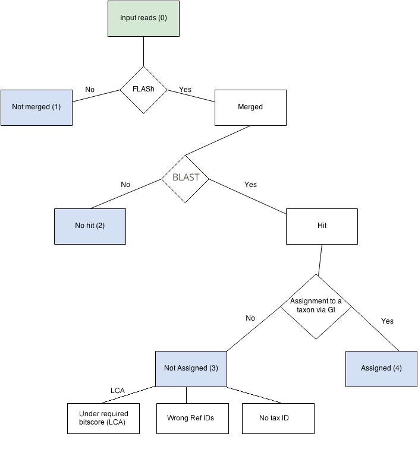

## Reads Fate log

**Metapasta pipeline overview**

In the Metapasta tool **all the reads** follow this process: 



Given we work with huge amount of reads in this kind of projects, it is extremely important to track the reads fate in an easy way.
We need to know to which point each read got in the process above. 

To track this we could classify the reads in these mutually exclusive categories (blue shaded in the diagram)

1. **notMerged**: Reads that were not merged after FLASh step
2. **noHit**: Reads that were merged in the FLASH step but did not have any hit in the database
3. **notAssigned**: Reads that were merged in the FLASh step, had a hit in the database but this hit (with its corresponding GI) was not assigned to any Taxon ID. This could be due to the lack of correspondence between GI - NCBI taxonomy IDs.
   - **notAssigned** (in LCA assignment mode) It includes the reads with a bitscore under the required threshold in the LCA method. [See file about LCA method](./LCA-MEGAN-like-taxonomy-node-assignment-algorithm.md)
   - **wrongRefIds** (the GI is not included in the table with the GI to TaxID mapping)
   - **noTaxId** (the TaxID to which mapped the GI is not included in the taxonomy tree)
               
4. **assigned**: Reads that passed the FLASh step, had hits with the database and the hits (with their GIs) had taxon ID correspondence so the reads could be assigned to the taxon ID 


    

**Reads fate log**

Given the categories described above are **mutually exclusive** this is always true: 

_The sum of the reads in each of the categories (1, 2, 3 and 4) is equal to the total number of reads (set called 0)_

```bash
0 = 1 + 2 + 3 + 4
```

So we need for each sample the following outcomes:

- Log file with the number of reads in each of the sets 

- An alert message if the law above is not true (something went wrong)


The number of reads in each subset are in the output file with sufix **stats**


